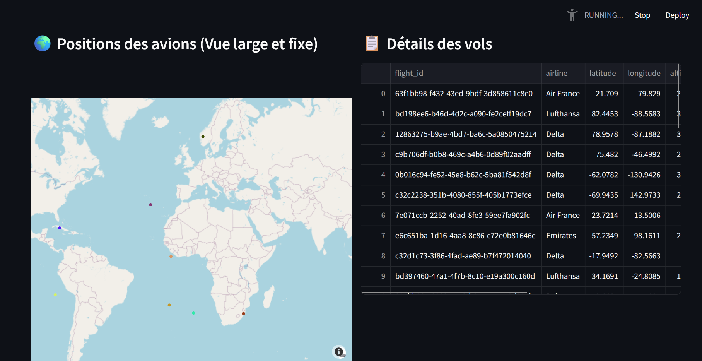
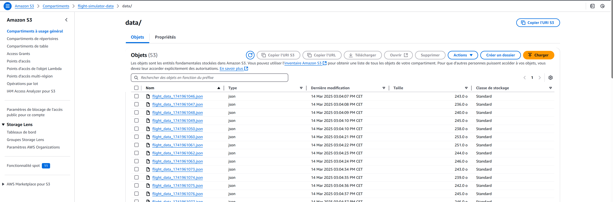

# Flight-Simulator-Project

## Description 📌
Ce projet est un simulateur de vol en temps réel qui génère des données de vol fictives et les envoie à **Apache Kafka**. Ces données sont ensuite stockées sur **AWS S3** et visualisées en temps réel via un **dashboard Streamlit**.

## 🖥️ Environnement
- **OS :** Windows
- **Langages :** Python
- **Technologies :** Kafka, AWS S3, Streamlit


## Architecture 🏗️
1. **Génération des données de vol** avec `Faker` et `random`
2. **Transmission des données à Kafka et AWS S3** (`flight_producer.py`)
3. **Vérification du stockage des données sur AWS S3** (`reponse_S3.py`)
4. **Visualisation des données en temps réel** (`dashboard_streaming.py`)

---

## 📦 Installation
### **1️⃣ Prérequis**
- **Python 3.x** installé
- **Kafka** installé et en cours d'exécution
- **AWS CLI** configuré avec accès S3
- **Virtualenv (optionnel, recommandé)**

### **2️⃣ Cloner le projet**
```bash
git clone https://github.com/ton-repo/Flight-Simulator-Project.git
cd Flight-Simulator-Project
```

### **3️⃣ Installer les dépendances**
```bash
pip install -r requirements.txt
```
#### 🛠 Dépendances
Fichier requirements.txt :
kafka-python,
pyspark,
boto3,
pandas,
streamlit,
plotly

---

## 📌 Configuration AWS S3
### **Créer un bucket AWS S3**
```bash
aws s3 mb s3://flight-simulator-data
```

### **Définir les permissions IAM pour S3**
Ajoute cette policy à ton utilisateur IAM :
```json
{
    "Version": "2012-10-17",
    "Statement": [
        {
            "Effect": "Allow",
            "Action": ["s3:PutObject", "s3:GetObject", "s3:ListBucket"],
            "Resource": [
                "arn:aws:s3:::flight-simulator-data",
                "arn:aws:s3:::flight-simulator-data/*"
            ]
        }
    ]
}
```
---

## 🚀 Exécution du projet

### **1️⃣ Démarrer Kafka**
Assurez-vous que Kafka et Zookeeper sont en cours d'exécution :
```bash
zookeeper-server-start.bat config/zookeeper.properties
kafka-server-start.bat config/server.properties
```
Créer un topic Kafka :
```bash
kafka-topics.bat --create --topic flight_data --bootstrap-server localhost:9092
```
Vérifier les topics existants :
```bash
kafka-topics.bat --list --bootstrap-server localhost:9092
```

### **2️⃣ Lancer le producteur Kafka**
Exécute `flight_producer.py` pour générer des données et les envoyer à Kafka :
```bash
python scripts/flight_producer.py
```

### **3️⃣ Lancer le stockage vers S3**
Exécute `s3_uploader.py` pour récupérer les données de Kafka et les stocker sur AWS S3 :
```bash
python scripts/s3_uploader.py
```

### **4️⃣ Vérifier les fichiers sur AWS S3**
```bash
aws s3 ls s3://flight-simulator-data/data/
```

### **5️⃣ Lancer le dashboard Streamlit - Visualisation en temps réel des vols sur une carte interactive.**
```bash
streamlit run scripts/dashboard_streaming.py
```
Puis ouvre [http://localhost:8501](http://localhost:8501) dans ton navigateur.

---

## ✅ Résumé
- **Kafka** pour l’ingestion de données.
- **AWS S3** pour le stockage.
- **Streamlit** pour la visualisation.


---

## 🔧 Dépannage
**1️⃣ Kafka : `NoBrokersAvailable` ?**
- Vérifie que Kafka tourne avec `jps | grep Kafka`
- Relance Kafka avec `kafka-server-start.bat config/server.properties`

**2️⃣ AWS S3 : `NoSuchKey` ?**
- Vérifie que les fichiers existent avec `aws s3 ls s3://flight-simulator-data/data/`
- Attends quelques secondes pour l’upload complet

**3️⃣ Streamlit ne se lance pas ?**
- Vérifie l'installation avec `pip install --upgrade streamlit`
- Lance avec `streamlit run scripts/dashboard_streaming.py`


---
### **1️⃣ Visualisation des données de vol**
Voici une capture d'écran montrant la visualisation en temps réel des positions des vols et des détails via le **dashboard Streamlit** :



### **2️⃣ Données de vol mises à jour**
Une autre capture d'écran montrant les données de vol mises à jour affichées dans le dashboard. On peut voir que de nouveaux points apparaissent, des points ont bougés sur la carte et que les coordonées de longitude et latitude ont été modifiés sur le tableau :


### **3️⃣ Téléchargements de fichiers AWS S3**
Enfin, voici une image du bucket AWS S3 où les fichiers de données de vol sont stockés :



---

## 📬 Contact
Auteur : KRIM Mohamed-Amine  
Email : mohamedamine.krim@outlook.com  
GitHub : [https://github.com/kma95870/Flight-Simulator-Project](https://github.com/kma95870/Flight-Simulator-Project)

---
🚀 Bon vol avec le **Flight Simulator Project** !
